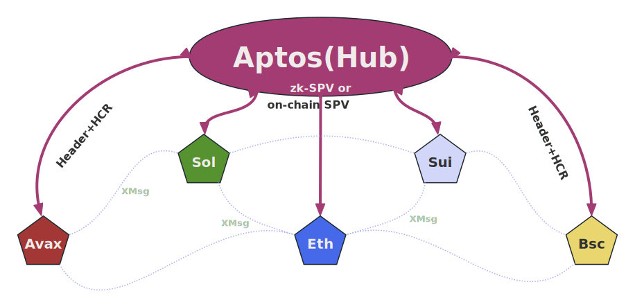
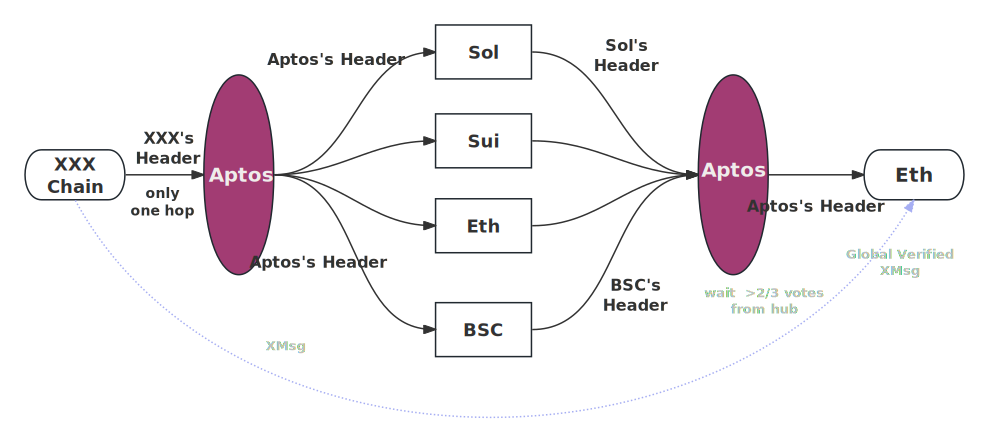

# AptosTrust: Make Aptos the Trust Hub

<!-- AptosTrust is a globally secure cross-chain architecure with Aptos as the trust hub. With global security among multiple heterogeneous blockchains, AptosTrust also achieves high performance with MOVE, a cutting-edge smart contract language. -->

AptosTrust 是一个可以在多链生态下保证全生态安全的高性能跨链架构。

AptosTrust 以高性能、去中心化、安全的 Aptos 区块链作为 Trust Hub。

得益于 Aptos MOVE 语言的并行执行机制，AptosTrust 在保证全生态高安全性的同时，也实现了多链交互过程的高性能。

AptosTrust 可以联通 Ethereum、Solana、Sui、Avalanche 等区块链，使得 Aptos 在未来繁荣的多链生态中可以占据核心位置，成为整个多链生态的 Trust Hub。



## 1. 问题背景

多链世界逐渐形成，多链间的交互也越发频繁，在高度去中心化、无许可的环境下，多链间的安全性也显得尤为重要。

当前的多链交互协议，比如 Cosmos、Wormhole、Chainlink、LayerZero、zkBridge、ZetaChain、EthRelay等，默认每个平行链是安全的，在此基础上，采用 multi-sig、SPV、zero-knowledge 等密码学技术保证多链交互安全，

然而，整个多链生态的安全性受限于安全等级最低的区块链，也就是多链生态在安全性方面存在 **“木桶效应”** 问题。攻击者只需要寻找攻击成本最低的区块链并发起攻击，如果该区块链被成功攻击，那么该区块链所产生的恶意跨链交易会扩散到整个多链生态，从而对 Aptos、Ethereum、Solana 等区块链造成不可挽回的损失。

针对多链生态的安全问题，国内外顶尖学术机构也做了一些探索，比如 Illinois Urbana-Champaign 大学提出了 TrustBoost(CCS'23)，南方科技大学提出了 CoChain(INFOCOM'23) 方案，这些方案的整体思想是在多个区块链（或者分片）之间进行 bft 共识（O(n^2)），这种做法也被叫做 Consensus on Consensus。这些方案的问题也很明显：负载非常高，因为这些方案本质上是将每个区块链视作一个节点，并没有深入研究区块链的特征以及多链生态下的新特性。

<!-- 目前，主流的多链交互协议（Cosmos、Wormhole、Chainlink，etc.）往往假设每个链是安全的，然后采用基于SPV的验证方法（链上合约直接执行SPV或者链下基于ZK简介执行SPV）保证与链相同的安全性。 -->

<!-- 为了解决这个问题，之前 Illinois Urbana-Champaign 大学的学者提出了 TrustBoost 协议（CCS'23），弱安全性区块链上的交易会被发送给其他区块链，被整个多链网络中 >2/3 数量的区块链认可后，才可以在本链确认，但是很显然的面临高负载问题；南方科技大学的学者面向多分片架构提出了CoChain（INFOCOM’23），提出了Consensus on Consensu，将每个分片视作一个节点，将每个分片的区块头交由其他分片执行bft共识，虽然只同步区块头，但是由于需要在多个分片间执行多轮共识，依旧会带来不小的负载，而且仅面向分片系统，忽略了跨链系统在安全性、架构方面的差异。所以，上述方案在多链生态下难以应用。 -->

## 2. 核心设计

我们提出了AptosTrust，采用了以 Aptos 为 Hub 的多链架构，同时发现了多链生态中的两个重要属性，基于这两个属性，AptosTrust 在保证安全性的同时，也可以保证多链交互的高效、低开销。具体来说，包括以下几个方面：

### 2.1 架构优化选型

**采用 Aptos 作为多链生态的 Trust Hub**

- 将 O(n^2) 的交互开销降低到O(n)
- 为什么选择 Aptos 作为多链生态的 Hub ？
  - 高性能，高安全性，去中心化
  - Move语言：并行执行
    - 作为 Trust Hub，每个平行链的数据之间冲突小，可并行程度高
- 为什么没有选择Sui：Aptos 对 Move 语言在并行执行、安全执行、可验证执行(MOVE prover)方面有着更先进的技术和生态支持。

### 2.2 两个重要的观察

基于 Hub 的跨链架构是很经典的跨链架构，真正让 AptosTrust 脱颖而出的是我们在多链生态下发现的两个重要且有趣的属性： 嵌套传递性，以及自确认性。

基于这两个属性，AptosTrust 不仅能够保证整个多链生态的全生态安全性，而且能够保持几乎线性级别的开销（通信开销，以及链上计算和存储开销）（相比较于传统方案）。



#### 2.2.1 观察1：嵌套传递 

**多链生态下，区块头具有 “嵌套传递性”**

该发现可以将数据广播跳数约束在常数范围内。

各个平行链不需要以明文形式获得其他平行链的区块头或者交易数据，利用嵌套传递和简短的有效性证明，就可以实现平行链之间在全生态范围内的有效性验证，既保证了安全性，又可以有效降低链间数据通信开销，以及链上数据计算、存储开销。

如何增强**平行链**在整个多链生态下的安全性？
  - Aptos(Hub) 与平行链之间通过 on-chain SPV 或者 zk-SPV 互相建立验证连接
    - 在 Aptos(Hub) 上，每个平行链只有一条经过 on-chain SPV 或者 zk-SPV 验证有效的合法区块头链
  - Aptos(Hub) 收集全网多数区块链对参与链的2/3认可（基于BFT安全模型，与已有方案类似）
    - 根据 “嵌套传递性”，认可结果最终会传递到目的平行链，从而可以验证收到的源链信息是否已经被整个多链生态共识

#### 2.2.2 观察2：自确认性

**多链生态下，Aptos作为Hub，具有“自确认性”**

虽然中继链自身是高安全的，但是在整个多链生态下，其安全性会降低（拜占庭节点比例增加，诚实节点比例减少）

如何增强 **Aptos(Hub)** 在整个多链生态下的安全性？

- 基于 Hub 架构，Aptos(Hub) 在为平行链增强安全性的同时，平行链也在为 Aptos(Hub) 增强在整个多链生态下的安全性
- 在区块头的嵌套传递性的基础之上，随着时间推移，Aptos(Hub) 的后序区块头中存在着前序区块头的全生态认可结果

### 2.3 阻止与恢复

怎么阻止恶意传播？
- 目的平行链收到源平行链的跨链消息时，如果没有收到足够认可结果，那么不会执行该跨链消息，从而阻止了该跨链消息对其他区块链上状态的影响

发现不安全的区块链后，如何恢复？
- 通过技术来发现，通过生态组织来恢复
- 对于某个区块链的某个高度，如果没有在全网达到 2/3，那么该只要有一个全节点保存着已经被确认安全的区块高度之前的所有数据，那么就可以组建新的委员会从该高度继续向后执行

> 安全恢复机制需要进一步论证实际可行性

## 3. 原型实现

基于 Aptos 和 Move 智能合约，以及 python 语言（链下实体），构建了 AptosTrust 的原型验证系统。我们也正在把 Ethereum、Sui、Solana、Avalanche 等区块链纳入该生态，从而做大规模的可行性验证（以及发 paper），这是一个比较庞大的工作，整个工作正在 heavy development，也欢迎感兴趣的朋友一起交流或者 co-author。

为了演示核心功能，我们目前仅开源了 Aptos(Hub) 的最核心的协议部分，用于说明我们的核心机理。

### 前置操作

安装 python 管理工具 pipenv
```bash
pip install pipenv
pipenv shell --python 添加 python3.11.5 的二进制程序路径
```

公私钥准备
```bash
# 进入指定文件夹
cd offchain/prepare_account
# 生成公私钥对, 会存储在 offchain/prepare_account/testkey 目录下
python genkey.py
# 获得 devnet 的 fund
python fund.py
# 终端中会输出 alice 的地址信息
```

将地址信息复制到 `Move.toml` 文件中，替换已有地址信息
```toml
[addresses]
kimroniny = "新生成的地址信息"
```

### 合约编译、测试与部署

```bash
# 切换到项目根目录下
cd ../../
# 初始化 aptos 环境
aptos init
# 编译合约
aptos move compile
# 测试合约
aptos move test
# 部署合约，指定私钥为刚才创建的私钥信息
aptos move publish --private-key-file offchain/prepare_account/testkey/Alice
```

### 链下操作

因为当前开源的最新版本是一个原型验证系统，所以为了方便展示，我们将核心操作内置在了一个脚本中，在输出日志中可以看到不同阶段的信息
```bash
python main.py
```

以下是各个阶段的日志信息

注册平行链阶段，每个平行链都会成为一个具有投票权的验证者
```bash
Connected to Aptos devnet
*********************************************************
register all parachains to Aptos(Hub)
--- VM Status: Executed successfully
--- Gas used: 5
regist parachain 1001 ok! Number of parachains: 1
--- VM Status: Executed successfully
--- Gas used: 5
...(略过)
regist parachain 1006 ok! Number of parachains: 6
--- VM Status: Executed successfully
--- Gas used: 5

```

平行链 1001 将区块头(1752849110173)同步到 Aptos(Hub), 并在 Aptos(Hub) 的区块(30702753)中被确认
```log
*********************************************************
store parachain(1001) header(1752849110173) on Aptos(Hub): ['30702753', '0x0102030405060708010203040506070801020304050607080102030405060708']
--- VM Status: Executed successfully
--- Gas used: 58
```

Aptos(Hub) 接收其他平行链的区块头, 并对区块(30702753)进行投票，直到收集足够的投票信息
```bash
>>> check votes of parachain(chainId=1001) header(height=1752849110174): 0/6
*********************************************************

*********************************************************
Aptos(Hub) collects parachain header(chainId=1001, height=1752849110174), included into block(30703393)
--- VM Status: Executed successfully
--- Gas used: 67
>>> check votes of parachain(chainId=1001) header(height=1752849110174): 1/6
*********************************************************
...(略过)
*********************************************************
Aptos(Hub) collects parachain header(chainId=1006, height=1752849110174), included into block(30704000)
--- VM Status: Executed successfully
--- Gas used: 60
>>> check votes of parachain(chainId=1001) header(height=1752849110174): 6/6
*********************************************************
```

## 4. 正在做以及未来要做的

- [ ] 将多链生态拓展到 Ethereum、Avalanche、Sui、Solana 等区块链
- [ ] 基于 AptosTrust 架构，构建多链资产安全交换应用
- [ ] 引入稳定币作为媒介资产，避免因中间资产遭受市场攻击导致降低多链生态攻击成本
- [ ] 采用 zk-SPV 实现 Aptos(Hub) 与平行链间的验证
- [ ] 进一步完善安全性理论证明
- [ ] 对整个系统的负载、链上开销、交互时延等指标进行评估

